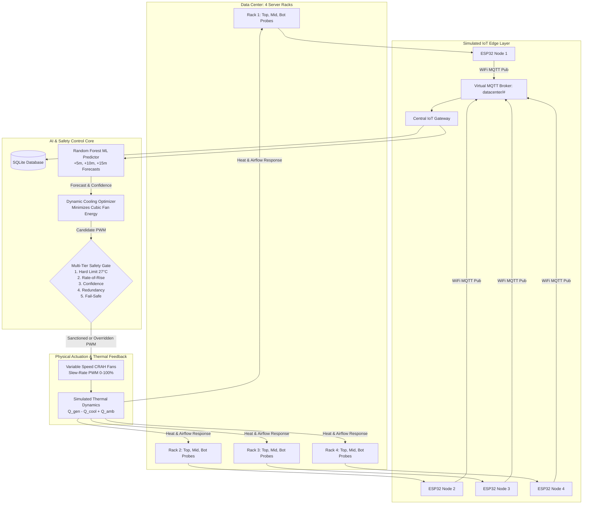

# AI-Based Predictive Thermal Management for Energy-Efficient Data Centers

> **Alternative Title:** *Safe AI-Driven Cooling Optimization Using Distributed IoT Sensors for Sustainable Data Centers*  
> **Type:** Academic Software Digital Twin / Full-Stack Simulation Prototype  
> **Scope:** IoT Architecture + Multi-Step ML Prediction + Multi-Tier Safety Guardrails + Aerodynamic Cooling Optimization

---

## 1. Project Overview & Objectives

Modern cloud and AI data centers consume massive amounts of electrical power, with **cooling infrastructure often accounting for 30% to 45% of total facility energy**. Traditional data centers over-provision cooling by running high-capacity fans and chillers at static high speeds (e.g., 80–100%) to safeguard against thermal runaway.

This project implements a **closed-loop digital twin simulation prototype** demonstrating how:
1. **Distributed IoT sensor nodes (simulated ESP32 over MQTT)** capture high-resolution local rack telemetry.
2. **Machine Learning regression (Random Forest)** predicts future thermal trajectories (+5, +10, and +15 minutes ahead) before physical heat accumulates.
3. **Multi-Tier Safety Guardrails** strictly verify every AI recommendation against hard physical laws, rate-of-rise limits, sensor consensus, and fail-safe fallbacks.
4. **Continuous Dynamic Optimization** exploits the **Fan Affinity Laws ($P \propto \text{RPM}^3$)** to dramatically lower cooling power while guaranteeing temperatures remain safely below thermal thresholds.

```
       ┌────────────────────────────────────────────────────────┐
       │               CLOSED-LOOP CONTROL CYCLE                │
       └────────────────────────────────────────────────────────┘
                                   │
                                   ▼
                       ┌───────────────────────┐
                       │  Simulated IoT Probes │ (3 Probes per Rack)
                       └───────────────────────┘
                                   │
                                   ▼
                       ┌───────────────────────┐
                       │  Virtual ESP32 Nodes  │ (Local sampling & JSON)
                       └───────────────────────┘
                                   │
                                   ▼
                       ┌───────────────────────┐
                       │  Virtual MQTT Broker  │ (QoS 1 Pub/Sub)
                       └───────────────────────┘
                                   │
                                   ▼
                       ┌───────────────────────┐
                       │  Central IoT Gateway  │ (Edge aggregation)
                       └───────────────────────┘
                                   │
                                   ▼
                       ┌───────────────────────┐
                       │  ML Prediction Engine │ (Future +5m, +10m, +15m)
                       └───────────────────────┘
                                   │
                                   ▼
                       ┌───────────────────────┐
                       │ Multi-Tier Safety Gate│ (5 Inviolable Rules)
                       └───────────────────────┘
                                   │
                     ┌─────────────┴─────────────┐
                     ▼                           ▼
            [ AI Overridden ]           [ AI Sanctioned ]
             Safety Fallback             Optimized PWM
                     │                           │
                     └─────────────┬─────────────┘
                                   │
                                   ▼
                       ┌───────────────────────┐
                       │ Cooling Fan Actuators │ (PWM Slew-Rate Dynamics)
                       └───────────────────────┘
                                   │
                                   ▼
                       ┌───────────────────────┐
                       │ Thermal Dynamics Env  │ (Heat Gen vs Extraction)
                       └───────────────────────┘
                                   │
                                   └──────────── (Feedback Loop repeats)
```

---

## 2. Complete Architecture (Mermaid)



---

## 3. Physical & Thermal Dynamics Model

The simulation implements physically sensible first-principles thermodynamic dynamics:

### 3.1 Computational Power & Heat Generation
Server rack electrical power consumption scales with computational utilization:
$$P_{rack} = P_{base} + (\text{CPU} \times k_{cpu}) + (\text{GPU} \times k_{gpu})$$
Where:
- $P_{base} = 160.0\text{ W}$ (idle motherboard, RAM, storage)
- $k_{cpu} = 2.4\text{ W per \%}$
- $k_{gpu} = 3.6\text{ W per \%}$ (high-density tensor accelerators)

Heat generated over interval $\Delta t$:
$$Q_{gen} = P_{rack} \times \Delta t\quad (\text{Joules})$$

### 3.2 Dynamic Airflow Heat Extraction
Cooling heat removal rate depends on fan speed, supply air temperature ($T_{inlet} = 18.5^\circ\text{C}$), cooling capacity, and mechanical degradation factor ($\eta_{mech}$):
$$Q_{cool} = \left(\frac{\text{Fan PWM}}{100}\right) \times \eta_{mech} \times P_{cool,max} \times \left(\frac{T_{current} - T_{inlet}}{8.0}\right) \times \Delta t$$

### 3.3 Thermal Inertia & Temperature Evolution
$$T(t+1) = T(t) + \frac{Q_{gen} - Q_{cool} + k_{ambient}(T_{ambient} - T(t))\Delta t}{C_{thermal}} + \mathcal{N}(0, \sigma)$$
Where $C_{thermal} = 420.0\text{ J/K}$ represents the thermal capacitance (thermal mass) of the server chassis.

### 3.4 Exhaust Air Temperature
$$T_{outlet} = T_{current} + \frac{P_{rack}}{\dot{m} C_p}$$
Airflow CFM scales dynamically with fan PWM, ensuring exhaust temperature physically rises when airflow drops under high load.

---

## 4. Cooling Energy Model & Cubic Fan Affinity Laws

Cooling electrical power is governed by the **aerodynamic Fan Affinity Laws**:
$$P_{fan} = P_{fan,max} \times \left(\frac{\text{RPM}}{\text{RPM}_{max}}\right)^3 = P_{fan,max} \times \left(\frac{\text{Fan PWM}}{100}\right)^3$$

Total data center cooling power:
$$P_{cooling} = P_{fan} + P_{base\_plant} + \frac{Q_{removed}}{\text{COP}_{chiller}}$$
Where $\text{COP}_{chiller} = 3.6$ is the chiller Coefficient of Performance.

### Why Optimization Yields Massive Energy Reductions:
| Fan Speed (PWM) | Relative Fan Power ($(\text{PWM}/100)^3$) | Electrical Power Draw |
| :---: | :---: | :---: |
| **100%** | $1.000$ (100.0%) | **450.0 W** |
| **80% (Traditional)** | $0.512$ (51.2%) | **230.4 W** |
| **65% (AI Predictive)** | $0.274$ (27.4%) | **123.3 W** |
| **50% (Idle)** | $0.125$ (12.5%) | **56.2 W** |

*Operating at 65% instead of 80% saves ~46% of fan electrical power, while operating at 65% instead of 100% saves ~73%!*

---

## 5. Machine Learning Prediction Pipeline

The predictive engine employs a multi-output **Random Forest Regressor** (`scikit-learn`) trained on synthetic telemetry capturing thermal lag, computational surges, and airflow dissipation.

### 5.1 Input Features
- `temperature`: Current verified rack temperature (°C)
- `temperature_lag_1, 3, 5`: Historical lag temperatures (capturing thermal capacitance delays)
- `temperature_slope`: $\frac{T - T_{-5}}{5}$ (thermal rate-of-rise)
- `cpu_usage` & `gpu_usage`: Computational utilization percentages
- `power`: Real-time rack electrical power (Watts)
- `fan_speed` & `airflow`: Actuator state and airflow CFM
- `ambient_temp`: External room ambient temperature (°C)

### 5.2 Targets & Evaluation Metrics
The model simultaneously predicts $+5\text{ min}$, $+10\text{ min}$, and $+15\text{ min}$ future temperatures:
- **Mean Absolute Error (MAE):** `0.1472 °C`
- **Root Mean Squared Error (RMSE):** `0.1922 °C`
- **Coefficient of Determination ($R^2$):** `0.9866`

---

## 6. Multi-Tier Safety Controller

AI recommendations are **never allowed to control physical cooling without verification**. The safety controller enforces 5 deterministic guardrails with a strict priority order:

1. **Safety 1: Hard Temperature Limit ($T > 27.0^\circ\text{C}$)**  
   If actual temperature reaches or exceeds 27.0°C, emergency cooling (100% fan) is instantaneously enforced. AI cannot override this rule.
2. **Safety 2: Rate-of-Rise Preemption ($\frac{dT}{dt} \ge 0.25^\circ\text{C}/\text{interval}$)**  
   If steep heating is detected, cooling is preemptively boosted to $\ge 82\%$ before the absolute ceiling is breached.
3. **Safety 3: Prediction Confidence Gating**  
   - $\text{Confidence} > 85\%$: Normal optimization allowed.
   - $\text{Confidence } 60–85\%$: Conservative $+8\%$ fan safety buffer added.
   - $\text{Confidence} < 60\%$: Safe cooling floor ($75\%$) strictly enforced.
4. **Safety 4: Sensor Redundancy Consensus (3 Probes per Rack)**  
   Probes A (top), B (middle), and C (bottom) are evaluated. If one probe deviates by $> 2.5^\circ\text{C}$ from the median, it is flagged as `SENSOR_FAULT` and control switches to median consensus.
5. **Safety 5: Fail-Safe Mode (Network / MQTT Disconnect)**  
   If MQTT messages, sensor feeds, or the gateway disconnect, AI control is completely disengaged and actuators default to a deterministic 80% fallback cooling speed.

---

## 7. Control Modes Comparison

The platform provides 3 selectable strategies for comparative analysis:
1. **TRADITIONAL (Static Baseline):** Continuous 80% fan speed regardless of workload.
2. **REACTIVE IoT:** Threshold rule ($T > 26.0^\circ\text{C} \implies 100\%$ fan, else $60\%$).
3. **AI PREDICTIVE:** Closed-loop multi-step optimization with safety verification.

---

## 8. Demonstration Scenarios & Presentation Mode

### Available Test Scenarios
- `NORMAL`: Steady-state operation (CPU 40%, GPU 35%, ~60% fan).
- `LOW_LOAD`: Idle cluster (CPU 20%, GPU 15%, cooling reduced safely).
- `HIGH_LOAD`: Heavy enterprise workload (CPU 80%, GPU 75%).
- `AI_WORKLOAD`: GPU tensor training (GPU 92-96%, predictive preemption demonstrated).
- `SUDDEN_SPIKE`: Rapid ramp-up (40% → 95% across 5 steps).
- `ML_FAILURE`: AI underpredicts heat during surge $\to$ Safety Controller overrides AI to 100%.
- `SENSOR_FAILURE`: Rack 2 Probe B spikes to 38.5°C $\to$ Median redundancy isolates fault probe.
- `NETWORK_FAILURE`: Broker disconnects $\to$ Fail-Safe 80% fallback engaged.
- `COOLING_FAILURE`: CRAH fan effectiveness drops to 25% $\to$ Thermal compensation activated.

### Automated Presentation Mode
Clicking **"PRESENTATION MODE"** runs a 2–3 minute guided script automatically progressing through the core narrative:
1. Baseline steady state $\to$
2. High GPU surge & proactive ML ramp-up $\to$
3. Injected AI prediction failure & instant Safety Override $\to$
4. Injected sensor anomaly & median fault isolation $\to$
5. Injected network drop & fail-safe fallback $\to$
6. Return to nominal steady state.

---

## 9. Technology Stack

- **Frontend:** React 19, Vite, Tailwind CSS, Lucide React, Recharts
- **Backend API:** Python 3.13, FastAPI, Uvicorn, WebSockets (10Hz live streaming)
- **Machine Learning:** scikit-learn (`RandomForestRegressor`), Pandas, NumPy
- **Persistence:** SQLite (`datacenter_sim.db`)
- **Testing:** `pytest` test suite

---

## 10. Installation & Quick Start

### Prerequisites
- Python 3.10+ (Python 3.13 supported)
- Node.js v18+ (Node.js v22 recommended)

### Step 1: Install Python Dependencies
```bash
python -m pip install -r requirements.txt
```

### Step 2: Install Frontend Dependencies & Build
```bash
cd frontend
npm install
npm run build
cd ..
```

### Step 3: Run the Complete Application
Launch the entire system (backend, ML model check, and frontend) with a single command:
```bash
python run_system.py
```
*Your browser will automatically open to `http://127.0.0.1:8000/`.*

### Step 4: Run Automated Tests
```bash
python -m pytest backend/tests/test_simulation.py -v
```

---

## 11. Academic Viva & Presentation FAQ

### Q1: What is IoT in this project?
*IoT refers to distributed, multi-probe micro-controllers (simulated ESP32 nodes) placed on individual server racks to provide localized thermal, power, and workload telemetry.*

### Q2: Why use MQTT instead of HTTP?
*MQTT uses a lightweight publish-subscribe pattern with tiny packet headers (2 bytes) and persistent TCP sessions, ideal for continuous high-frequency sensor streams.*

### Q3: Why can't AI directly control cooling without a safety layer?
*ML models are statistical approximations subject to domain drift or anomalies. Direct control in mission-critical facilities creates risks of hardware damage or fires. Deterministic safety guardrails must act as an inviolable gatekeeper.*

### Q4: How does dynamic cooling save energy?
*Fan power scales cubically with speed ($P \propto \text{RPM}^3$). Modulating fan speed from 80% to 60-65% cuts fan electrical power consumption by ~40% to 60%.*

### Q5: What is the academic scope?
*This is a software digital twin prototype built to simulate and demonstrate closed-loop predictive thermal management, validated via unit tests and thermodynamic equations.*
